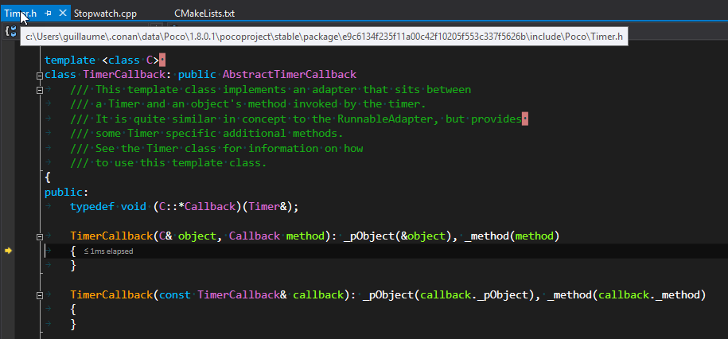
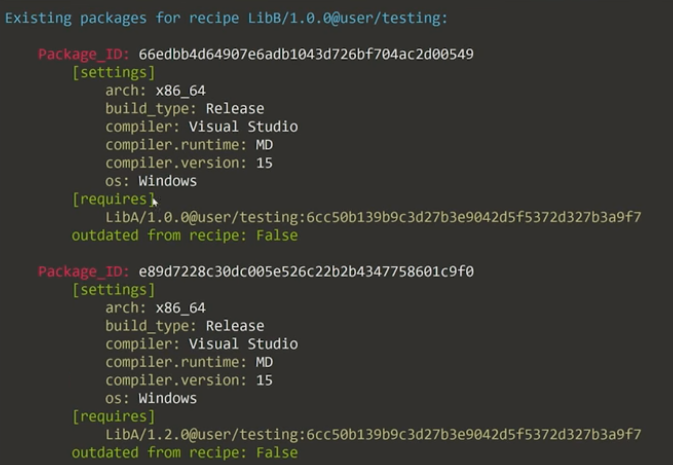

<font size="7">Conan C++ package manager</font>

# Let's follow the conan doc

http://docs.conan.io/en/latest/index.html

# Some features

- compatible with different build systems
- package recipes in python
- dependency management
- can run your own conan-server
- can be hosted on JFrog Bintray
- conan-center is a curated central public repository
- conan-transit non-reviewed packages

# Install conan

```
py -3 -m pip install conan
```
Make sure to have your python3 scripts dir in your path, ex: `C:\Dev\Python36\Scripts`.<br>

## Alternatively, run conan from the python sources in the cloned git repo

```
git clone https://github.com/conan-io/conan.git
cd conan
pip install -r conans/requirements.txt
```
Create a `conan.py` file and add it to your its directory to your PATH:
```python
#!/usr/bin/env python3
import sys
sys.path.append("/path/to/conan/repo/conan")s
from conans.client.command import main
main(sys.argv[1:])
```

# Build a project using dependencies fetched with conan

```
git clone https://github.com/memsharded/example-poco-timer.git C:\Dev\conan\mytimer
```

in `C:\Dev\conan\mytimer`, there are 2 conan related files:

- `CMakeLists.txt` : how to build mytimer.exe
```cmake
project(MyTimer)
cmake_minimum_required(VERSION 2.8.12)
include(${CMAKE_BINARY_DIR}/conanbuildinfo.cmake)  # cmake use conan stuff
conan_basic_setup()                                # cmake use conan stuff
add_executable(timer timer.cpp)                    # specific to your project
target_link_libraries(timer ${CONAN_LIBS})         # cmake use conan stuff
```

- `conanfile.txt` : mytimer dependencies
```
[requires]
Poco/1.8.0.1@pocoproject/stable

[generators]
cmake
```

# Conan profiles

Conan profiles define **settings**.<br>
in `C:\Users\guillaume\.conan\profiles`, let's create the file `win64-vs15-debug`:
```
[build_requires]
[settings]
os=Windows
os_build=Windows
arch=x86_64
arch_build=x86_64
compiler=Visual Studio
compiler.version=15
build_type=Debug
[options]
[env]
```
and the equivalent `win64-vs15-relase`<br>
any setting can be overriden on the conan cmd line using `-s name=value`

# conan install

in `C:\Dev\conan\mytimer`:
```
mkdir build/release && cd build/release
conan install ..\.. -pr win64-vs15-release && cd ..\..
```

`conan install` will:
- Auto detecting your dev setup to initialize the profile
- download stuff in `C:\Users\guillaume\.conan`
  - from the conan-center https://conan.bintray.com
- put 3 files in `C:\Dev\conan\mytimer\build\release`
  - `conanbuildinfo.cmake` : the cmake defined variables
  - `conanbuildinfo.txt` : the cmake defined variables
  - `conaninfo.txt` : settings, requirements and options is saved

similarly for debug:
```
mkdir build/debug && cd build/debug
conan install ..\.. -pr win64-vs15-debug && cd ..\..
```

To override the profile settings in the cmd line:
```
conan install ..\.. -s build_type=Debug
```

# debug and release packages

in conan, debug and release are just another set of packages, for example:
- zlib release: `C:\Users\guillaume\.conan\data\zlib\1.2.11\conan\stable\package\6cc50b139b9c3d27b3e9042d5f5372d327b3a9f7\lib\zlib.lib`
- zlib debug: `C:\Users\guillaume\.conan\data\zlib\1.2.11\conan\stable\package\8cf01e2f50fcd6b63525e70584df0326550364e1\lib\zlibd.lib`

1 recipe => N packages


# `conanfile.txt` contain options

let's modify `conanfile.txt` to add non-default options for the Poco:
```
[requires]
Poco/1.8.0.1@pocoproject/stable

[generators]
cmake

[options]
Poco:enable_xml=False     # default=True
Poco:enable_json=False    # default=True
Poco:enable_mongodb=False # default=True
```

You can see the available options for a package inspecting the recipe python file.<br>
print the recipe in the terminal:
```
conan get Poco/1.8.0.1@pocoproject/stable
```
or simply open the file:
```
C:\Users\guillaume\.conan\data\Poco\1.8.0.1\pocoproject\stable\export\conanfile.py
```

conan install:

```cmd
mkdir build\debug-custom && cd build\debug-custom
conan install ..\.. -pr win64-vs15-debug && cd ..\..
```

triggers the error:

```
ERROR: Missing prebuilt package for 'Poco/1.8.0.1@pocoproject/stable'
Try to build it from sources with "--build Poco"
Or read "http://docs.conan.io/en/latest/faq/troubleshooting.html#error-missing-prebuilt-package"
```

install (and build) the dependencies:

```
mkdir build\debug-custom && cd build\debug-custom
conan install ..\.. -pr win64-vs15-debug --build=missing && cd ..\..
```

This creates a third package (in addition to the debug and release ones) package in:
C:\Users\guillaume\.conan\data\Poco\1.8.0.1\pocoproject\stable\package\db6afb7d348af6485d2b5072b91d6723258a0f21

# Generate the project and build it

For now we have just installed (and/or build) dependendencies. To build mytimer, let's use cmake:<br>

on windows:
```
cd build\release
cmake ..\.. -G "Visual Studio 15 2017 Win64"
cmake --build . --config Release
cd ..\..
```

on linux:
```
cd build/release
cmake .. -G "Unix Makefiles" -DCMAKE_BUILD_TYPE=Release
cmake --build .
cd ../..
```

The whole conan-install, cmake-generate, cmake-build is:
- using cd build\release:
```
mkdir build\release
cd build\release
conan install ..\.. -pr win64-vs15-release
cmake ..\.. -G "Visual Studio 15 2017 Win64"
cmake --build . --config Release
cd ..\..
```
- from the root directory:
```
conan install . -pr win64-vs15-release -if build/release
cmake -H. -Bbuild/release -G "Visual Studio 15 2017 Win64"
cmake --build build/release --config Release
```

# Generate the project and build open it in visual studio

The sln is generated in `C:\Dev\conan\mytimer\build\release\MyTimer.sln`.
- One confusing thing is that the sln contains 4 classic cmake configs: Debug, MinSizeRel, Release, RelWithDebInfo.
  - Debug does not compile
  - MinSizeRel and RelWithDebInfo do compile, but it's unclear if they do what they are supposed to


# Fetch more conan packages using more "remotes"

visit: https://bincrafters.github.io
run:
```
conan remote add bincrafters https://api.bintray.com/conan/bincrafters/public-conan
```
remotes are stored in `C:\Users\guillaume\.conan\registry.txt`


# browse the local cache

`C:\Users\guillaume\.conan\data`<br>
`conan search` : inspect the local cache<br>
`conan remove` : remove packages from the local cache<br>
`conan install Poco/1.7.8p3@pocoproject/stable` : install a package and its dependencies, but using a `conanfile.txt` is the recommended approach.

# JFrog bintray

automated automatic distribution of software

for enterprise: SAML authentification
hosts packages (some can be private)
simple rest api
easy to setup an automated workflow with GutHug and TravisCI
provites an out of the box web UI
fast to publish to jCenter
geolocated downloads
maintains metadata associated with the downloads
integrated with jFrog artifactory

# JFrog artifactory

universal artifactory repository
binaries hosting

# bintray vs artifactory

https://stackoverflow.com/questions/38877177/what-is-the-difference-between-jfrog-artifactory-and-bintray

The main difference between artifactory and bintray is in the intended usage.
- Artifactory is a development-time tool
- Bintray is a release, distribution-time tool.
It might look like a subtile difference, but it has great impact on the feature set of the products:

- For **development** (Artifactory) you need features like:
  - support for snapshots
  - CI servers metadata integration (a.k.a. build-info)
  - promotion between repositories
  - on-prem install
  - development site replication
  - integration with enterprise security systems like SAML
  - etc.
- For **distribution** (bintray) you need stuff like:
  - a global distribution network (CDN)
  - extreme throughput and redundancy for downloads
  - permission control for external users (entitlements)
  - product and EULA support
  - etc

https://bintray.com/bincrafters


# conan and multi configurations (debug, release)

Conan generates different package binaries for debug and release. They are created, uploaded and installed independently, and it is not possible to change this.


## cmake_multi

http://conanio.readthedocs.io/en/latest/reference/generators/cmakemulti.html
http://docs.conan.io/en/latest/integrations/cmake/cmake_multi_generator.html

```
conan install . -g cmake_multi -pr win64-vs15-release -if build/multi --build=missing
conan install . -g cmake_multi -pr win64-vs15-debug   -if build/multi --build=missing

cmake -H. -Bbuild/multi -G "Visual Studio 15 2017 Win64"

cmake --build build/multi --config Release
cmake --build build/multi --config Debug
```

The `conan install . -g cmake_multi ...` commands will generate 3 files:
- `conanbuildinfo_release.cmake`: Variables adjusted only for build_type Release
- `conanbuildinfo_debug.cmake`: Variables adjusted only for build_type Debug
- `conanbuildinfo_multi.cmake`: Which includes the other two, and enables its use

in the CMakeLists.txt file, you must also use `conanbuildinfo_multi.cmake` instead of `conanbuildinfo.cmake`
```
include(${CMAKE_BINARY_DIR}/conanbuildinfo_multi.cmake)
```

# DOC

http://docs.conan.io/en/latest/using_packages/workflows.html

$ git clone https://github.com/memsharded/example-hello.git
$ conan install ./example-hello -s build_type=Debug --build=missing -if example-hello-build/debug
$ conan install ./example-hello -s build_type=Release --build=missing -if example-hello-build/release

$ cd example-hello-build/debug   && cmake ../../example-hello -G "Visual Studio 15 2017 Win64" && cd ../..
$ cd example-hello-build/release && cmake ../../example-hello -G "Visual Studio 15 2017 Win64" && cd ../..

You can use the `--install-folder` or `-if` to specify where to generate the output files or create manually the directory and change to it before execute the conan install command.
=> in visual studio, there wil be 2 solutions, one for debug, one for release


# cmake install --build

|command_line_option|                |
|-------------------|----------------|
--build             | Build all from sources, do not use binary packages.
--build=never       | Never build, use binary packages or fail if a binary package is not found.
--build=missing     | Build from code if a binary package is not found.
--build=outdated    | Build from code if the binary is not built with the current recipe or when missing binary package.
--build=[pattern]   | Build alway these packages from source, but never build the others. Allows multiple --build parameters. 'pattern' is a fnmatch file pattern of a package name. Default behavior: If you don't specify anything, it will be similar to --build=never, but package recipes can override it and decide to build with "build_policy"


# text generator

http://conanio.readthedocs.io/en/latest/reference/generators/text.html

conan generates the `conanbuildinfo.txt` file, it's a generic config file with [sections] and values.

# Imports (to copy the proper dlls)

In Windows and OSX, the simplest approach is just to copy the shared libraries to the executable folder, so they are found by the executable, without having to modify the path.

```
[requires]
Poco/1.7.8p3@pocoproject/stable

[generators]
cmake

[options]
Poco:shared=True
OpenSSL:shared=True

[imports]
bin, *.dll -> ./bin    # Copies all dll   files from packages bin folder to my "bin" folder
lib, *.dylib* -> ./bin # Copies all dylib files from packages lib folder to my "bin" folder
```


# cmake find_packages() are not required when using conan

Let's remember that with conan, find_packages are actually not necessary, and such usage of find_package is provided for a transparent integration with previously existing CMakeLists. With a cmake if() and a few lines, the problem is gone. Moreover, the cmake code necessary to integrate an existing library is less with conan that having to write a custom find_package for the library.


# debug packages sources, where are my pdb ?

```
conan install . -pr win64-vs15-debug -if build/debug --build Poco
cmake -H. -Bbuild/debug -G "Visual Studio 15 2017 Win64"
cmake --build build/debug --config Debug
```
will produce warnings about not finding pdb.

https://stackoverflow.com/questions/45524995/can-i-retrieve-the-source-code-of-the-library-packaged-with-conan-package-manage<br>
There are two strategies that might work to debug dependencies:

## 1. Forcing it to build from sources, with the --build=PkgName argument.

When you build from sources the package, depending on the build system, **it is possible that the binary artifacts reference the temporary build folder where the package was built**, and then be able to find them and use the to debug. This strategy can work for third party packages, even when they do not consider debug.

This works with Poco 
```
conan install . -pr win64-vs15-debug -if build/debug --build Poco
cmake -H. -Bbuild/debug -G "Visual Studio 15 2017 Win64"
cmake --build build/debug --config Debug
```

Even if Poco does not package pdb, in its conanfile, the generated libs do have a path to the pdb 

```
poco = C:\Users\guillaume\.conan\data\Poco\1.8.0.1\pocoproject\stable

{poco}
+ package
  + e9c6134f235f11a00c42f10205f553c337f5626b
    + ./lib/PocoCryptomdd.lib
    + does not contain any pdb
+ build
  + e9c6134f235f11a00c42f10205f553c337f5626b
    + ./build/Crypto/Crypto.dir/Debug/Crypto.pdb
    + more pdbs

{poco}\package\e9c6134f235f11a00c42f10205f553c337f5626b\lib\PocoCryptomdd.lib
contains the absolute path
{poco}\build\e9c6134f235f11a00c42f10205f553c337f5626b\build\Crypto\Crypto.dir\Debug\Crypto.pdb
so the pdb can be found
```



**Note that**: --build=PkgName always forces the rebuild, which is quite annoying

## 2. package the sources too

If you are creating the packages yourself, and you want to be able to directly debug the binary artifact, without re-building it from source, then the correct way would be to package the sources too.
- in the package conanfile.py:
  - make sure to generate the debug information in build()
  - copy the cpp in package()
- on the consumer side
  - [imports] the cpp files so that debugger can find them (<- not too sure about that)
  - If the debugger needs some help to locate those sources, then it should be used.


# Conan youtube video notes

Faster Delivery of Large C/C++ Projects with Conan Package Manager and Efficient CI
https://www.youtube.com/watch?v=xA9yRX4Mdz0

conan developers: Diego Rodriguez, Losada Gonzales

conan meant to build big projects and make binaries available

conanfile.py

package ID = SHA1 of settings, options, sources...

Jenkins (teamcity)
A Jenkinsfile has stages
- get recipe
- create package
- upload package (to artifactory here)

LibB requires LibA
Jenkins builds LibA when LibA changes
Jenkins builds LibB when LibAB changes using LibA binaries from artifactory

Artifactory web interface shows the packages 


in App
```
cd build
rm -rf *
conan install ..
conan build ..      # as if I run cmake manually
```

conan can have different dependency graphs depending on platfrom, build_type


## minor dependency change
LibA v1.0.0 -> LibA v1.0.1

solution 1<br>
1. manual change B now depends on LibA/1.0.1<br>
2. conan alias
3. version-range
4. version overriding

class AppConan(ConanFile):
   requires(("LibA/101@...", "override"), ...)

App depends-on LibB depends-on LibA
App can using
- LibA v1.0.1
- LibB v1.0.0
even if LibB depends on LibA

## major dependency change

if LibA has a change in its API, ex LibA v1.2.0<br>
the override cannot work<br>
```
class AppConan(ConanFile):
   requires(("LibA/1.2.0@...", "override"), ...)
```

BUT LibB still depends on what wad in the headers of LibA


Package ID
- in C++, LibB depends on LibA
- even if LibA API does not change
- if a LibA inline function implementation changes then LibB binaries change
```
settings  |
options   | => SHA1
requires  |
```
conan allows to specify what is part of the SHA1 generation
```python
def package_id(self):
    pass # default id generation, # LibB DOES NOT depends on requirements (LibA) minor versions

def package_id(self):
    self.info.settings.compiler.version = "Any" # compiler version not part of the id generation

def package_id(self):
    self.info.requires.minor_mode() # LibB DOES depends on requirements minor versions

```
I don't want to generate another package id for when GCC 4.8 and 4.9

**LibB/1.0.0** has 2 builds
- one that depends on LibA/1.0.0
- one that depends on LibA/1.2.0

- even if LibB source code has NOT changed
- even if LibA 1.0.0 and 1.2.0 have the same API
There are 2 builds of LibB/1.0.0, as if there were 2 configs, 2 platforms...

## build_requires
requires = ("LibA", "")
build_requires = ("Catch/1.9.4@...", "cmake/3.9@...") 

build_requires can be used for BUILD requirements
- retrieved only when conan build from sources
- can put cmake so that packages that use cmake3.9 can call it
  - as long as we have a conan package for cmake 3.9
  - inject this requirement in profile, recipes, conanfile.txt
  - different packages can be built with different versions of cmake !

## questions
- why semantic versioning is the default ?
- LibB->LibA, why does LibB decide if a bump of LibA 1.0.X requires a package of LibB, instead of LibA deciding this...
- some companies
  - bump the version X.Y.Z+1 for everything
  - do something else


