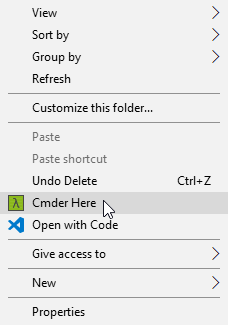
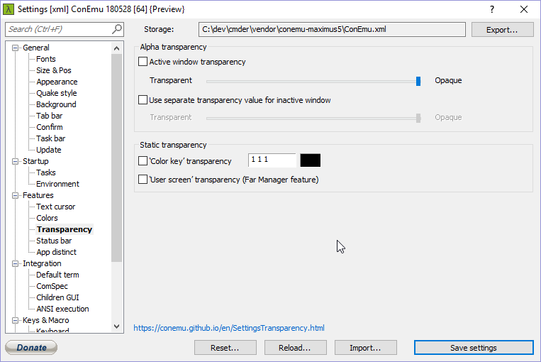

# cmder

https://github.com/cmderdev/cmder

Cmder.exe Command Line Arguments

```
cmder /START start_path
```

# Shortcut to open Cmder in a chosen folder

- Open a terminal as an Administrator
- Navigate to the directory you have placed Cmder
- Execute .\cmder.exe /REGISTER ALL If you get a message "Access Denied" ensure you are executing the command in an Administrator prompt.



# Remove transparency


