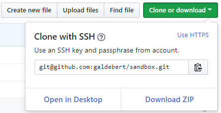

# Using SSH with github

http://guides.beanstalkapp.com/version-control/git-on-windows.html#installing-ssh-keys

https://help.github.com/articles/generating-a-new-ssh-key-and-adding-it-to-the-ssh-agent/

https://confluence.atlassian.com/bitbucket/set-up-an-ssh-key-728138079.html

https://docs.microsoft.com/en-us/vsts/repos/git/use-ssh-keys-to-authenticate?view=vsts

SSH public key authentication works with a pair of generated encryption keys.
- The public key is shared and used to encrypt messages.
- The private key is kept safe and secure on your system and is used to read messages encrypted with the public key.


# 1. Generate an SSH key for that computer

If you enter a passphrase. The **SSH agent** manages your SSH keys and remembers your passphrase, so that you don't have to reenter your passphrase every time you use your SSH key.


## check `ssh-keygen` and `ssh-agent` on windows

We'll need to run OpenSSH's `ssh-keygen`. It looks like we can use either:
- the git-bash version
- the windows version

```
λ where ssh-keygen
C:\Windows\System32\OpenSSH\ssh-keygen.exe
C:\dev\git\usr\bin\ssh-keygen.exe

λ where ssh-agent
C:\Windows\System32\OpenSSH\ssh-agent.exe
C:\dev\git\usr\bin\ssh-agent.exe
```

Let's use git-bash: `C:\dev\git\git-bash`


## check `ssh-keygen` and `ssh-agent` on Linux 

```
guillaume@linux:~/dev/galdebert$ which ssh-keygen
/usr/bin/ssh-keygen

guillaume@linux:~/dev/galdebert$ which ssh-agent
/usr/bin/ssh-agent
```


## Generate the key

and run:
```
ssh-keygen -t rsa -b 4096
```
- `-t rsa` is the encoding (note it's rsa by default)
- `-b 4096` is the number of bits
- this asks for the key file location, default is `C:\Users\galde\.ssh`, it's fine, press enter
- this asks for a **passphrase**, no need for one, press enter.
  - If set, the passphrase will be asked every time the ssh key is used, unless an ssh-agent is used. The advantage that the passphrase gives you is that if someone is able to read your private key, they are 'unable' to use it.
- by default the label (aka comment) will be `galde@DESKTOP-N8ACAMP` i.e. user@machine
- this will also print the key fingerprint, you can later retrieve the fingerprint with
  - `ssh-keygen -lf C:/Users/galde/.ssh/id_rsa.pub`

Now the key is generated

in `C:\Users\galde\.ssh`:
- `id_rsa` contains the private key, **this has to remain secret all the time**
- `id_rsa.pub` contains the public key, that you can put on the internet


# 2. Only if you used a passphrase: Add your key to the ssh-agent

If you gave a passphrase, be sure to configure the SSH agent to cache your passphrase so you don't have to enter it every time you connect.

## a. Ensure the ssh-agent is running

If you are using Git for Windows, you can use the "Auto-launching the ssh-agent" instructions in "Working with SSH key passphrases", or start it manually:
```
eval $(ssh-agent -s)
```

## b. Add your SSH private key to the ssh-agent

```
ssh-add ~/.ssh/id_rsa
```

# 3. Add the SSH key to your GitHub account.

- copy the **ENTIRE** content of the `id_rsa.pub` file **MINUS THE LAST NEWLINE**
  - the key starts with `ssh-rsa` and ends with `galde@DESKTOP-N8ACAMP`
- go to https://github.com/settings/keys
- click `New SSH Key`
- enter title, for ex: galde@DESKTOP-N8ACAMP
- paste the key
- click `Add SSH Key`

# 4. test if out ssh key is is working with github

https://help.github.com/articles/testing-your-ssh-connection/

run

```
ssh -T git@github.com
```

you get a message:
```
The authenticity of host 'github.com (192.30.253.112)' can't be established.
RSA key fingerprint is SHA256:xxxxxxxxxxxxxxxxxxxxxxxxxxxxxxxxxxxxxxxxxxx.
Are you sure you want to continue connecting (yes/no)?
```

If the fingerprint matches `SHA256:nThbg6kXUpJWGl7E1IGOCspRomTxdCARLviKw6E5SY8` as described in:
https://help.github.com/articles/github-s-ssh-key-fingerprints/,

then type `yes`.

This will also add `github.com` to `C:/Users/galde/.ssh/known_hosts`


# 5. configure a repo to use ssh instead of https

First retrieve the SSH address:




## For an existing repo that uses https:

https://docs.microsoft.com/en-us/vsts/repos/git/use-ssh-keys-to-authenticate?view=vsts#migrate

```
git remote set-url origin git@github.com:galdebert/sandbox.git
```

## For a new cloned repo

```
git clone git@github.com:galdebert/sandbox.git
```
