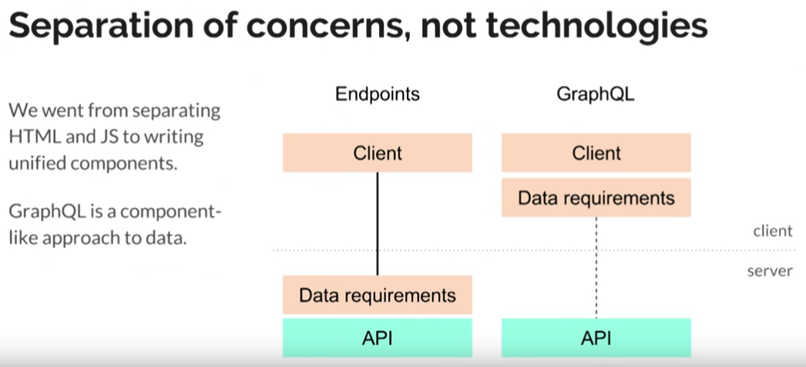

Zero to GraphQL in 30 Minutes – Steven Luscher
https://youtu.be/UBGzsb2UkeY

pip install graphene[django] django_graphiql

import graphene

graphene helper methods that help define a graphql schema
class

graphene
graphiql
python framework

# Building a GraphQL Server
https://www.youtube.com/watch?v=PEcJxkylcRM

using express + express-graphql

- GraphQL queries an API, can work with
- SQL queries the data

GraphiQL runs in the browser
- edit queries

json-server = mock the database

with graphql, we can use:
mongodb
mangoose
MySQL

apollo = front end for graphql
relay

# graphcool

graph.cool
graphcool is a backend for graphql with online hosting

functions

in Berlin

# Serverless GraphQL Architecture – The Future of Backend Development

https://www.youtube.com/watch?v=PTphFRHJ3d0

GraphQL:
- is a query language for **APIs**
- is a declarative way of fetching & updating data

with REST, 3 endpoints, 3requests:
- users/\<id\>
- users/\<id\>/posts
- users/\<id\>/followers

with graphQL, 1 endpoint, 1 query
- the query declares what it needs

## The GraphQL Schema

type Message {
    text: String!
    sentBy: Person
}

type Person {
    name: String!
    messages: [Message!]!
}

// Query is a root type
type Query {
    Message(id: ID!): Message
    allMessage(id: ID!): [Message!]!
}

// Mutation is a root type
type Mutation {
    createMessage(text: String!): Message
    updateMessage(id: ID!, text: String!): Message
    deleteMessage(id: ID!): Message
}

// 3 root types: Query, Mutations, Subscriptions

- microservices use pub-sub system
- serverless functions (FaaS)
  - AWS
  - Google Cloud Finction
  - MS Azure

## The Graphcool Framework

a new level of abstraction for backend development
- from the graphQL schema (??) auto generated CRUD GraphQL API based on data model
- use event driven core to implement business logic
- global type system determined by the GraphQL schema
this abstracts the database

serverless functions
- hooks: synchronous data validation & transformation
- subcriptions: trigerring asynchronous events
- resolvers: custom GraphQL queries & mutations

I implement myfunction.js and register it 

graphql playground is similar to postman for http

# Apollo

# Lessons from 4 Years of GraphQL
https://youtu.be/zVNrqo9XGOs

fragments
mutations
subscriptions
native code generation
persisted queries
graphical
relay

graphql is "versionless" because as long we just add stuff, we are good
We cannot remove stuff.

stop thinking in terms of endpoint
graphQL uses only ONE endpoint

graphQL is a thin API that sits on top of other stuff:
- database: sql, mongo
- cache

# lesson to build stuff

- Solve a real super important problem
- Problems drive Priorities
- Think like the clients
- Have a First Client
- embed within the First Client team 
- Incremental Adoption
  - Make things easy to replace existing stuff piece by piece
  - try before you commit to decision
- Evolve, don't rewrite
- Every time you are asked for a feature, answer YAGNI: You Ain't Gunna Need It
- Adding something is more cognitive cost
- Avoid "Second System Syndrome": high risk of over-design
- Software is about Communication
  - Have a devil advocate (as an editor)
- Don't open source too early, because you cannot evolve that easily
- Encourage measured risks
- Trust your experienced engineer

Elon Musk: Reasoning from First Principles

# Sashko Stubailo - The GraphQL Stack: How everything fits together

https://youtu.be/ykp6Za9rM58

Apollo is a team/community centered on GraphQL

GraphQL specifies
- data requirements
- capabilities

Apollo maintains graphQL client 

GraphQL server can be written in any language

CACHING ?
- GraphQL is transport independent
- HTTP caching is HTTP specific

idea 1: cache in the server <= NO

idea 2:
cache in front of the graphQL server
cache in front of the backend
GraphQL client - GraphQL gateway - GraphQL server
                 ^^^^^^^^^^^^ 
                 Apollo Engine

**Relay** is a new framework from Facebook that provides data-fetching functionality for React applications. It was announced at React.js Conf (January 2015).

# GraphQL: A Vision for Success in the Enterprise
https://www.youtube.com/watch?v=L0Oy9ok7D88

When is GraphQL the right tool for the job
Not a silver bullet

Github approach to security with groups assigned with specific parts of the schema. it's an opiniated approach but shows the flexibility of the graphql and how secutiry can be implemented

OAuth

GraphQL can be complement to existing REST, gRPC

GraphQL is production ready: Facebook, Github, yelp, iflix

Arvata
- API Gateway
- calls
  - APIs: REST gRPC SOAP endoints
  - Faas(serverless suite): AWS lambda, Google Cloiud Function, Azure, OpenWhisk
  - Queues/Events: Kafka, RabbitMQ, AWS SQS
  - Databases: Oracle, MySQL, Mongo, Neo4j (graphDB)

# GraphQL APIs: REST in Peace
https://www.youtube.com/watch?v=a52vko4BcNA

