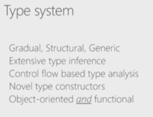
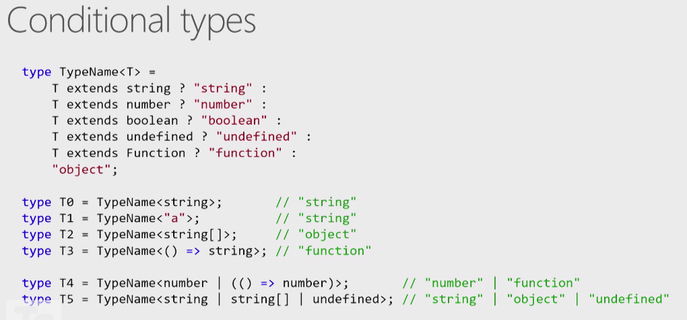
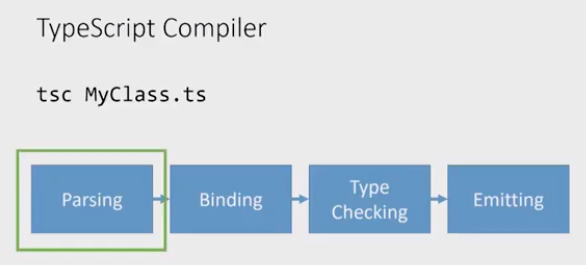

# typescript

https://youtu.be/wpgKd-rwnMw

DefinitelyTyped is most active project on github

TS + Babel: now can use TS as type checker and Babel as the emitter. Useful because React uses Babel.

# intersection types, union types

## A & B
- intersection type = less inclusive possible values (domains)
- keyof (A & B) = keyof A | keyof B
- intersection type have a union of the property names

## A | B
- union type = create a union of possible values (domains)
- intersection type and union typer speak about the value domain

- the most encompassing object type is {}
- the more properties you add to the type, the more constrained you make its possible values 

# --strict
enables all possible type checks

# Conditional types

# tsserver

editor <--json--> tsserver (node.js)

tsserver keeps your project in its own memory and listen to editor keystrokes

tsserver gives javascript statement completion thanks to .d.ts file and jsdoc

gives type errors if `// @ts-check` is added at the start of the js file, in a more lenient mode

# future: composite projects in future 3.0

project reference other projects
A depends on B
B changes internally, A is not rebuilt

client <--+
          +-- shared
server <--+

test <-- src

# TalkScript with the TypeScript Team

https://www.youtube.com/watch?v=MxB0ldQfvT4

webassembly

- keyof
- union type
- structural typing
- descriminated union

OOP = code and data are together
but it's not always nice
- ex: serialization

Functional Programming
- just functions and parameters
- the polymorphism goes away, there is overhead
- immutability (hard to have in OOP), no state transition, build structures from scratch

# TLDR

- CommonJS, requirejs
- ES6 modules are different from existing practices
- node modules
- webpack, babel, typescript

import { a, b } from xxx

# Static Analysis and Source Code Manipulation in TypeScript

David Sherret

https://www.youtube.com/watch?v=CTpKZgy0dpo

# Demystifying TypeScript Decorators

https://www.youtube.com/watch?v=05FC8Wh7C5w

- declarative programming: says what you want
- imperative programming: says how to get what you want
- No native support for decorator in browser
- Transpilers to support decorators: typescript and babel

