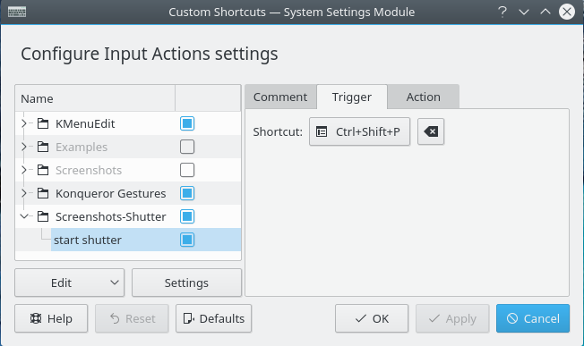

# Shortcuts

`alt+space`: Kubuntu search bar
`ctrm+esc`: View processes


# Run command same terminal

run kate while removing log
```
kate filename 2>/dev/null
```

run kate and continue using the same terminal
```
kate filename 2>/dev/null &
```


# Edit the common directories: desktop, documents, downloads...
```
~/.config/user-dirs.dirs
```


# How to change the shutter keyboard shortcut

To change the shutter keyboard shortcut, open kubuntu Custom shortcut and add:




# How to add a link to the taskbar

- right click > create new > link to application
- set command, for ex: code path/to_file/or/dir
- change the icon
- this creates a .desktop file
- drag n drop the .desktop file in the taskbar 
  - this will copy the .desktop file in
    - /home/guillaume/.local/share/plasma_icons
    - /home/guillaume/.local/share/applications/
  - and register it somewhere so that it's in the tasbar


# SSH

```
sudo apt-get install openssh-server
sudo service ssh status
```

change config
```
sudo nano /etc/ssh/sshd_config
```

restart the service
```
sudo service ssh restart
```

configure the firewall to enable ssh<br>
https://www.digitalocean.com/community/tutorials/ufw-essentials-common-firewall-rules-and-commands
```
sudo ufw allow from 192.168.0.0/24 to any port 22
```


# ip addresses

get private IP
```
ip addr show
hostname -I
```

get public IP
```
dig +short myip.opendns.com @resolver1.opendns.com
```


# onedrive

install onedrive from muon (it's a build of https://github.com/skilion/onedrive)

enable the systemd service
```
systemctl --user enable onedrive
```

start
```
systemctl --user start onedrive
```

the onedrive service will start on startup

to monitor the service:
```
journalctl --user-unit onedrive -f
```


# xdrp

1. install a windowing system compatible with xdrp: xubuntu-desktop
```
sudo apt install aptitude
sudo aptitude update && sudo aptitude install xubuntu-desktop
```

2. install xrdp
```
sudo apt-get install xrdp
```


# Force 2560x1440 resolution (useless as long as we use HDMI)

1. create file set2560x1440 with content:
#!/bin/sh
xrandr --newmode 2560x1440R 241.50 2560 2608 2640 2720 1440 1443 1448 1481 +hsync -vsync
xrandr --addmode HDMI-2 2560x1440R
xrandr --output HDMI-2 --mode 2560x1440R

2. register this file to run on session startup
alt + space : system > startup and shutdown > autostart > Add script... > 
will create a sysmlink or copy to
/home/guillaume/.config/autostart-scripts/set2560x1440

``` 
~guillaume
+--startup_scripts
     +--set2560x1440
     +--start_ssh
```

