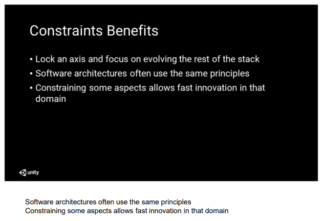
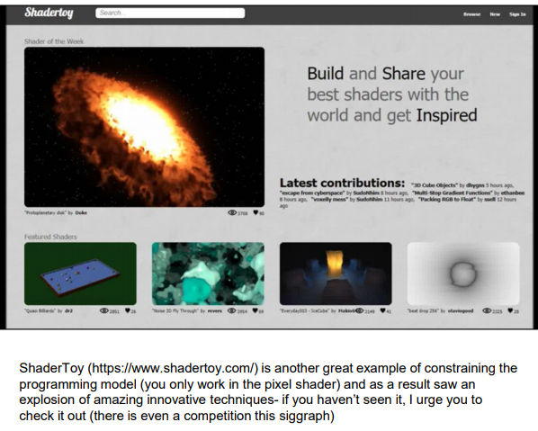
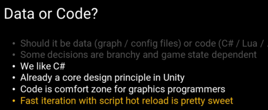

Natalya Tatarchuk
original Destiny @ Bungie where I was the graphics lead and engineering architect
lead the graphics team for Destiny 2
graphics research and demo team @ AMD

What are the properties of frameworks that support better innovation? 

Easy sharing of reproducible behavior (for example, sharing full shader packages for
RenderMonkey shaders with code and content) speeds up learning throughout the
community. Of course the best is end-to-end runnable executable with full content

Frameworks that help innovation should provide solid infrastructure that allows users
avoiding boiler plate code. For graphics, this means providing asset and object
management, threading, low-level platform support, etc.

Well, the good news is we are now at the point where the game and graphics engine
provide that functionality directly. For example you can easily use the free Unity
personal edition and distribute projects with full content, where the engine will
manage object loading / unloading, resource management, like creation of textures,
shaders, meshes, etc., and runtime layers for rendering. 

Plus we have huge affinity to C#, so in some ways, this was already a core design
principle for Unity. Plus having a full debuggable IDE for coding the render pipeline
brought an additional comfort zone element for programmers (and also not having to
debug parsers is a nice plus!).

And I gotta say that fast iteration with script hot reload is a really nice thing for
graphics development. It took me ten years to get that back, but I’m glad to have it
back. 

