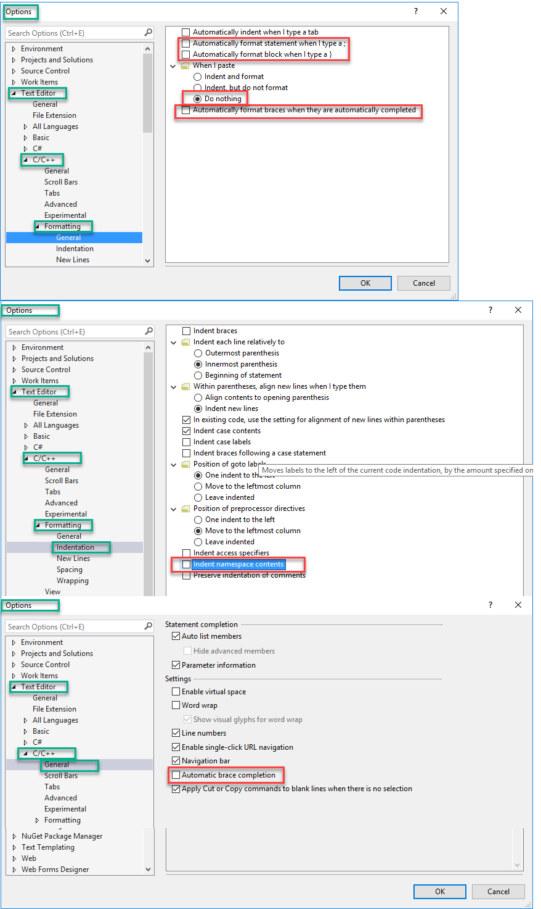
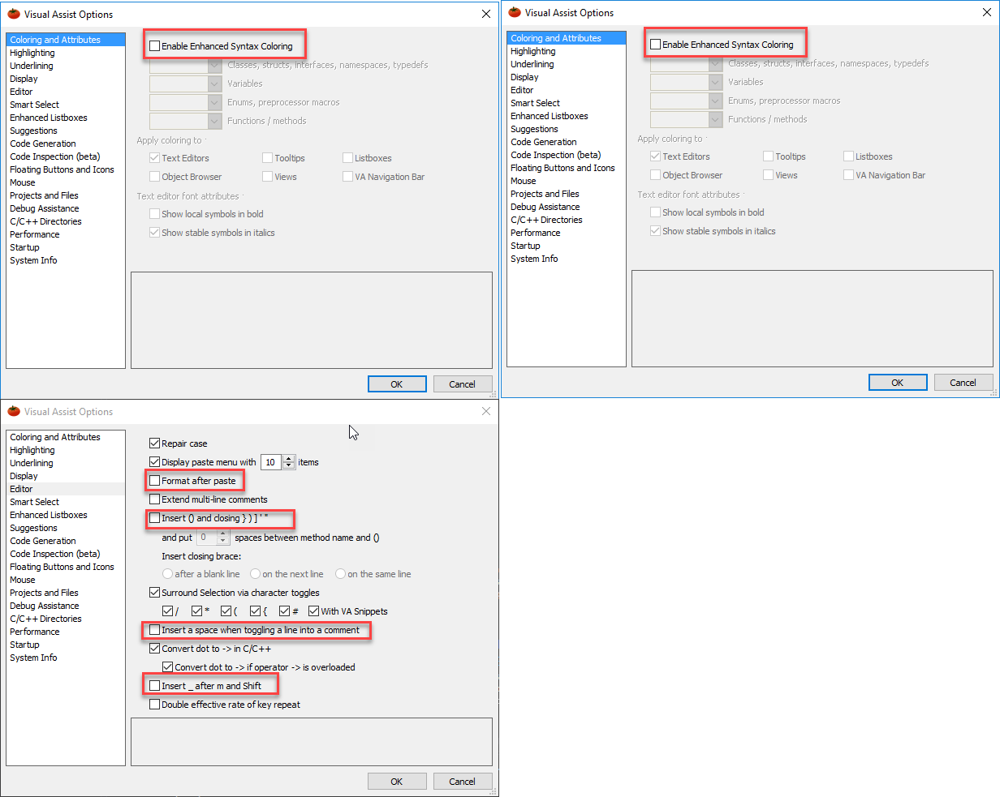
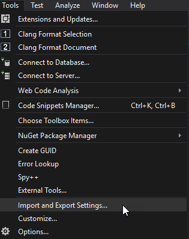

# Steps to remember when installing visual studio

## Visual Studio TextEditor

## Visual Assist Options

## extensions

- [clang format](https://marketplace.visualstudio.com/items?itemName=HansWennborg.ClangFormat)
- [trailing whitespace visualizer](https://marketplace.visualstudio.com/items?itemName=MadsKristensen.TrailingWhitespaceVisualizer)

## import settings

and import:
- [galdebert-vs-2015-colors.vssettings](./galdebert-vs-2015-colors.vssettings)
- [galdebert-vs-2015-keyboard-shortcuts.vssettings](./galdebert-vs-2015-keyboard-shortcuts.vssettings)
- [galdebert-vs-2017-texteditor-cpp.vssettings](./galdebert-vs-2017-texteditor-cpp.vssettings)
